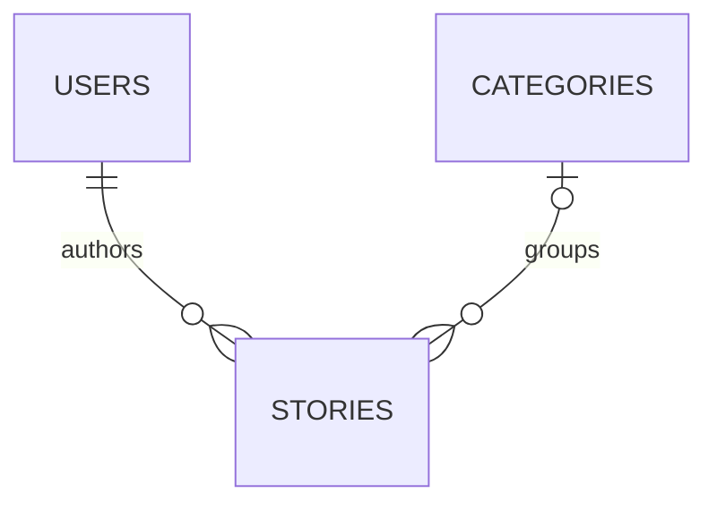

# Story Library — PHP and MySQL

[**English**](README.md) · [**فارسی ←**](README.fa.md)

A Persian-language university application by **Reza Ranjbar** for categorized stories, accounts, author editing, and administrator moderation. This revised educational edition repairs the original source and preserves its database relationships.

## Local setup

Requires PHP 8.1+ with `pdo_mysql`, `mbstring`, and `gd`, plus MySQL. See [verification](VERIFICATION.md) for the tested versions and results.

1. Create a **new empty** database named `library` using `utf8mb4`. Import `database/schema.sql` into it. This is not an upgrade script for an existing database.
2. Create an application database user with SELECT, INSERT, UPDATE and DELETE access to this database. Keep its password outside source control.
3. Set `DB_HOST`, `DB_PORT`, `DB_NAME`, `DB_USER`, and `DB_PASS` in the environment of the PHP process. Host, port and database default to `127.0.0.1`, `3306`, and `library`; `DB_USER` must be set.
4. From this repository folder, run `php -S 127.0.0.1:8080 -t public` and open `http://127.0.0.1:8080`.
5. Register an account using a password of 12–72 bytes. New users always receive role 0. To make a local administrator, use your database tool to set **only your verified account's** `users.role` to 1. There is no public role-upgrade endpoint.

For PowerShell, after creating the database and its application user, set the actual values in the same terminal:

```powershell
$env:DB_HOST = '127.0.0.1'
$env:DB_PORT = '3306'
$env:DB_NAME = 'library'
$env:DB_USER = 'library_app'
$securePassword = Read-Host 'Local database password' -AsSecureString
$env:DB_PASS = [System.Net.NetworkCredential]::new('', $securePassword).Password
php -S 127.0.0.1:8080 -t public
```

PHP reads process environment variables; it does not automatically load `.env`. Serve **only `public/`**. Do not use a root database account for the application.

## Features

- Published-story reading and category browsing.
- Password-hashed registration/login with the original image CAPTCHA workflow.
- Author creation, editing, deletion, and profile updates.
- Administrator story moderation and regular-user removal.

Profile updates require the current password. Cover images must already exist in `public/assets/uploads`; no HTTP file-upload handler is provided.



Deleting a user cascades their stories; deleting a category leaves its stories uncategorized. Deletion is permanent in this local demonstration.

## Changes from the submission

The malformed escaping helper was repaired. Output is escaped, destructive actions use CSRF-protected POST forms, session IDs regenerate on authentication, roles refresh from the database, and record IDs/profile/story fields/cover names are validated. Database configuration comes from the environment. Missing CSS references, malformed date formats, and invalid CSS properties were corrected. The original Persian interface is retained.

## Verification

To run the automated integration checks with installed PHP/MySQL binaries:

```text
python tests/integration.py --php PATH_TO_PHP --mysql-bin PATH_TO_MYSQL_BIN_DIRECTORY
```

The test runner creates a **separate temporary MySQL instance** on loopback and new ports. It never connects to your normal database. It stops both servers and prints the retained test directory for inspection. Root without a password is used only inside that isolated fixture, not as the application's documented configuration.

## Limits and attribution

This is a local coursework demonstration. Before Internet deployment it needs robust rate limiting, account recovery, email verification, pagination, an accessible CAPTCHA alternative, and a deployment-specific security review. No complete-security claim is made.

GitHub hosts the source. GitHub Pages cannot run this PHP/MySQL backend; link to this repository from the static portfolio.

Original coursework: Reza Ranjbar. Cleanup, checks and documentation were prepared with AI assistance. No user records, passwords, or original cover artwork are included.
