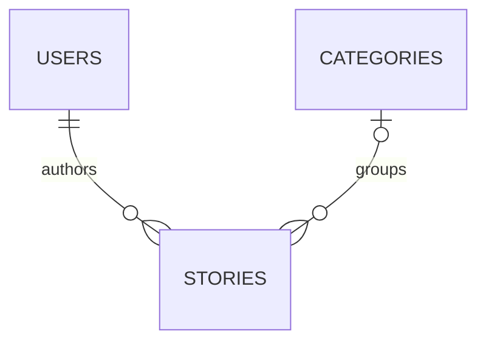

[**فارسی**](README.md) | [English](README.en.md)

<div dir="rtl">

# کتابخانه داستان — PHP و MySQL

این کتابخانه داستان فارسی را به‌عنوان پروژه دانشگاهی با PHP و MySQL ساختم. کاربران می‌توانند حساب بسازند، داستان منتشر کنند و دسته‌بندی‌ها را ببینند؛ مدیر هم امکان نظارت بر محتوا را دارد. این نسخه شامل اصلاحات کد اولیه است و روابط پایگاه داده در آن حفظ شده‌اند.

## راه‌اندازی محلی

پیش‌نیازها: **PHP نسخه 8.1 یا بالاتر** با افزونه‌های `pdo_mysql`، `mbstring` و `gd`، به همراه **MySQL**. نسخه‌های آزمایش‌شده و نتایج در [گزارش بررسی](VERIFICATION.md) آمده‌اند.

1. یک پایگاه داده **جدید و خالی** به نام `library` با مجموعه‌نویسه `utf8mb4` بسازید و فایل `database/schema.sql` را در آن وارد کنید. این فایل، اسکریپت ارتقای پایگاه داده موجود نیست.
2. یک کاربر پایگاه داده مخصوص برنامه با دسترسی‌های SELECT، INSERT، UPDATE و DELETE روی همین پایگاه داده ایجاد کنید. رمز آن را در مخزن کد قرار ندهید.
3. متغیرهای محیطی `DB_HOST`، `DB_PORT`، `DB_NAME`، `DB_USER` و `DB_PASS` را برای فرایند PHP تنظیم کنید. مقادیر پیش‌فرض میزبان، پورت و نام پایگاه داده به‌ترتیب `127.0.0.1`، `3306` و `library` هستند. تنظیم `DB_USER` الزامی است.
4. از پوشه اصلی پروژه، دستور زیر را اجرا کنید و آدرس `http://127.0.0.1:8080` را در مرورگر باز کنید.

</div>

```text
php -S 127.0.0.1:8080 -t public
```

<div dir="rtl">

5. یک حساب با رمز عبور ۱۲ تا ۷۲ بایت ثبت کنید. نقش کاربران جدید همیشه صفر است. برای ایجاد مدیر در محیط محلی، با ابزار مدیریت پایگاه داده مقدار `users.role` را **فقط برای حساب خودتان که هویت آن را بررسی کرده‌اید** به ۱ تغییر دهید. برنامه مسیر عمومی برای ارتقای نقش کاربر ندارد.

در PowerShell، پس از ایجاد پایگاه داده و کاربر مخصوص برنامه، مقادیر واقعی را در همان ترمینال تنظیم کنید:

</div>

```powershell
$env:DB_HOST = '127.0.0.1'
$env:DB_PORT = '3306'
$env:DB_NAME = 'library'
$env:DB_USER = 'library_app'
$securePassword = Read-Host 'Local database password' -AsSecureString
$env:DB_PASS = [System.Net.NetworkCredential]::new('', $securePassword).Password
php -S 127.0.0.1:8080 -t public
```

<div dir="rtl">

PHP متغیرهای محیطی فرایند را می‌خواند؛ فایل `.env` به‌صورت خودکار بارگذاری نمی‌شود. ریشه وب‌سرور باید **فقط پوشه `public/`** باشد. برای اجرای برنامه از حساب root پایگاه داده استفاده نکنید.

## امکانات

- خواندن داستان‌های منتشرشده و مرور دسته‌بندی‌ها.
- ثبت‌نام و ورود با هش‌کردن رمز عبور و کپچای تصویری.
- ایجاد، ویرایش و حذف داستان توسط نویسنده و به‌روزرسانی اطلاعات حساب.
- نظارت مدیر بر داستان‌ها و حذف کاربران عادی.

تغییر اطلاعات حساب به رمز عبور فعلی نیاز دارد. تصاویر جلد باید از قبل در `public/assets/uploads` قرار داشته باشند؛ برنامه بخش بارگذاری فایل از طریق HTTP ندارد.

## روابط پایگاه داده

هر کاربر می‌تواند چند داستان داشته باشد و هر داستان می‌تواند به یک دسته‌بندی تعلق داشته باشد. دسته‌بندی برای داستان اختیاری است.

</div>



<div dir="rtl">

حذف کاربر، داستان‌های او را نیز حذف می‌کند. حذف دسته‌بندی، داستان‌های آن را بدون دسته‌بندی باقی می‌گذارد. در این نسخه محلی، حذف دائمی است.

## اصلاحات نسبت به نسخه اولیه

تابع ناقص ایمن‌سازی خروجی اصلاح شده است. متن‌های خروجی برای جلوگیری از تفسیر ناخواسته به‌عنوان HTML، escape می‌شوند. عملیات حذف و تغییر وضعیت از فرم‌های POST با محافظت CSRF استفاده می‌کنند. شناسه نشست هنگام احراز هویت بازتولید می‌شود و نقش کاربر از پایگاه داده به‌روزرسانی می‌شود.

شناسه رکوردها، فیلدهای حساب و داستان و نام فایل جلد اعتبارسنجی می‌شوند. تنظیمات اتصال پایگاه داده از محیط خوانده می‌شوند. ارجاع به فایل CSS ناموجود، قالب‌های تاریخ نادرست و ویژگی‌های نامعتبر CSS نیز اصلاح شده‌اند. رابط فارسی اولیه حفظ شده است.

## بررسی و آزمون

برای اجرای آزمون‌های یکپارچه‌سازی، با استفاده از نسخه‌های نصب‌شده PHP و MySQL، دستور زیر را اجرا کنید. عبارت‌های جایگزین را با مسیر فایل اجرایی PHP و پوشه فایل‌های اجرایی MySQL عوض کنید:

</div>

```text
python tests/integration.py --php PATH_TO_PHP --mysql-bin PATH_TO_MYSQL_BIN_DIRECTORY
```

<div dir="rtl">

تستز یک **نمونه موقت و جداگانه MySQL** روی آدرس محلی و پورت‌های جدید ایجاد می‌کند و به پایگاه داده معمول شما متصل نمی‌شود. در پایان، هر دو سرور را متوقف می‌کند و مسیر پوشه آزمون را برای بررسی نمایش می‌دهد. استفاده از root بدون رمز فقط به همین محیط آزمون جداگانه محدود است و تنظیم پیشنهادی برنامه نیست.

نتایج اجرای واقعی و محدوده بررسی‌ها در [گزارش بررسی](VERIFICATION.md) ثبت شده‌اند.

## محدوده پروژه

این پروژه یک نمونه آموزشی برای اجرای محلی است. پیش از انتشار عمومی روی اینترنت، به محدودسازی مناسب نرخ درخواست، بازیابی حساب، تأیید ایمیل، صفحه‌بندی، جایگزین دسترس‌پذیر برای کپچا و بررسی امنیتی متناسب با محیط استقرار نیاز دارد. این نسخه برای یادگیری و نمایش در محیط محلی در نظر گرفته شده است.

GitHub میزبان کد منبع است. GitHub Pages نمی‌تواند بخش PHP و MySQL این برنامه را اجرا کند؛ در وب‌سایت نمونه‌کارها به همین مخزن پیوند بدهید.

اطلاعات کاربران، رمزهای عبور و تصاویر جلد نسخه اولیه را در مخزن قرار نداده‌ام تا راه‌اندازی پروژه با یک پایگاه داده خالی انجام شود.

</div>
